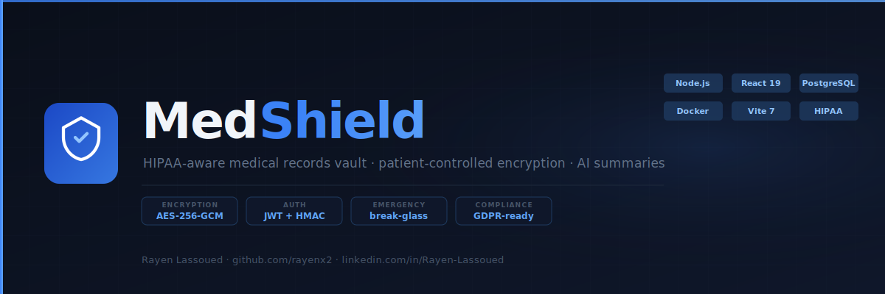

# MedShield

<p align="center">
  
  
  
  
  
  
</p>

<p align="center">
  <strong>HIPAA-aware medical records vault — patient-controlled encryption, consent governance, AI summaries</strong><br/>
  Emergency access workflows · encrypted health data · Node/Express + React · European healthcare ready
</p>

<p align="center">
  
</p>

> A HIPAA-aware medical records vault that puts patients in full control of their encrypted health data — with consent governance, emergency access workflows, and AI-powered document summaries.

## Live Demo

Open `demo/index.html` in any browser — no backend required.

## Overview

MedShield solves healthcare data fragmentation: patients' records are scattered across hospitals, leading to delayed diagnoses, repeated tests, and unsafe care in emergencies. The platform centralizes records under patient ownership with explicit consent management. It targets European healthcare organizations operating under GDPR and German KHZG digital health funding mandates.

Designed for use by German hospital groups (Helios, Asklepios, Charité), general practitioners, and health tech companies building patient-facing portals.

## Architecture

```
┌───────────────────────────────────────────────────────┐
│              React 19 Frontend (Vite 7)               │
│    Patient Portal · Doctor Dashboard · Hospital View  │
└─────────────────────┬─────────────────────────────────┘
                      │  HMAC Bearer Token Auth
┌─────────────────────▼─────────────────────────────────┐
│              Node.js + Express 5 API                  │
│  /auth  /api/documents  /api/access-requests          │
│  /api/emergency-access  /api/ai/summarize              │
└──────┬──────────────┬───────────────┬─────────────────┘
       │              │               │
┌──────▼──────┐ ┌─────▼──────────┐ ┌─────▼──────────────┐
│ PostgreSQL  │ │ Appwrite /     │ │  Groq               │
│  10 tables  │ │ Local Disk     │ │  Llama 4 Scout      │
│  Full schema│ │ (auto-fallback)│ │  (vision) +         │
│             │ │                │ │  Llama 3.3 (text)   │
└─────────────┘ └────────────────┘ └────────────────────┘
```

## Tech Stack

| Technology | Version | Purpose |
|---|---|---|
| React | 19 | Patient, doctor, hospital dashboards |
| React Router | 7 | Client-side routing |
| Vite | 7 | Frontend build tooling |
| Node.js + Express | 20 / 5 | REST API backend |
| PostgreSQL | 16 | 10-table relational schema |
| Drizzle ORM | latest | Schema management + migrations |
| Appwrite | cloud (optional) | Encrypted document blob storage — falls back to local disk if unconfigured |
| Groq | Llama 4 Scout / Llama 3.3 70B | AI document summarization (vision + text) |
| bcryptjs | 3 | Password hashing |
| AES-256-GCM | Node crypto | Document encryption at rest |
| Vitest + RTL | latest | Frontend tests |
| node:test | built-in | Backend integration tests |

## Quick Start

```bash
git clone git@github.com:rayenx2/MedShield.git
cd MedShield
cp .env.example .env
# Edit .env — set SESSION_SECRET (DATABASE_URL is pre-configured for Docker)
docker compose up -d
# Open http://localhost:5177 (frontend)
# API at http://localhost:3001/health
```

> Document storage and the rest of the app work out of the box with **zero cloud config**: if
> `APPWRITE_*` env vars are left blank, uploads are encrypted and stored on local disk under
> `server/storage/` instead of Appwrite. Set the Appwrite vars to use cloud storage in production.
> Same for AI summarization — leave `GROQ_API_KEY` blank and that one endpoint returns
> "AI service not configured" while everything else works normally; set it to enable real
> document analysis via [Groq](https://console.groq.com/keys) (has a free tier).

### Sample test documents

`testdata/` has 6 synthetic medical documents (CBC lab report, prescription, discharge summary,
diagnosis note, chest X-ray, brain MRI) for exercising upload/download/AI-summary without
needing real files. See `testdata/README.md` for details and licensing — none of it is real
patient data.

## Features

- Encrypted document vault — AES-256-GCM encryption per document with unique DEK
- Role-based access control — separate patient, doctor, hospital auth flows and dashboards
- Consent governance — full access request lifecycle: request, approve, reject, revoke, expire
- Emergency break-glass access — 24-hour window with full audit trail, requires patient opt-in
- AI medical summarization — Groq (Llama 4 Scout vision model for images, Llama 3.3 70B for text) analyzes uploaded documents, returns structured clinical + plain-language summaries
- Drug interaction tracking — doctors record drug interaction notes per patient, surfaced automatically during emergency access
- Immutable audit log — every action logged to PostgreSQL with IP, user-agent, timestamp
- Rate limiting — 20 login attempts/15 min, 10 registrations/hour
- CORS controls — explicit origin allowlist

## Testing

```bash
# Backend integration tests — 13 cases covering every API route end to end
# (requires the Docker stack running: docker compose up -d)
npm run test:api

# Frontend unit/component tests — 29 cases (Vitest + React Testing Library)
npm test
```

CI (`.github/workflows/ci.yml`) runs both suites plus ESLint and a `docker compose config` validation on every push.

## Results

- 10-table PostgreSQL schema with proper FK constraints, indexes, and enum types
- AES-256-GCM encryption: 12-byte IV + 16-byte GCM AuthTag + ciphertext layout
- 6 incremental migration files covering schema evolution from init through drug interactions and access-request fixes
- Emergency access completes in a single API call returning decrypted vitals, medications, and drug interactions
- AI pipeline: decrypt on-the-fly in memory, base64 encode, real Groq vision/text call, return structured analysis — verified against real documents (chest X-ray, CBC report) with genuine model output
- HIPAA-compliant append-only audit logger with SHA-256 chained checksums (see `server/src/audit_logger.py`)
- Every document round-trips byte-identical through encrypt → store → decrypt → download (verified across PDFs and images)

## What I Built

- Added `docker-compose.yml` — runs PostgreSQL + API + frontend locally with one command
- Created and maintained `.env.example` with all documented variables
- Added HIPAA-compliant audit logger (`server/src/audit_logger.py`) with tamper-detection via SHA-256 chained checksums
- Added `PORTFOLIO.md` with European market positioning and interview talking points
- Rebranded project from `medshield-react` to `MedShield`
- Removed original team author references
- Created `demo/index.html` — fully interactive browser demo with patient record viewer, AI output, drug interaction notes, an emergency break-glass simulation, and live audit trail simulation
- Added local-disk storage fallback (`server/src/appwrite.js`) so document upload/download work fully without an Appwrite account
- Migrated AI summarization from OpenRouter/GPT-4o to Groq (Llama 4 Scout vision + Llama 3.3 70B text), verified live against real documents
- Fixed 3 schema bugs found by full endpoint testing: missing `access_requests.document_ids` column, two missing `audit_action` enum values (`ai_summarize`, `request_document_access`), and a missing unique constraint needed by the access-grant upsert (`db/migrations/0006_access_request_documents.sql`)
- Fixed 2 functional UI bugs found during manual testing: a session-refresh race condition that bounced authenticated users back to login on every page reload, and a `patient_email`/`patientEmail` key mismatch that left the Shared Documents table's email column permanently blank
- Added a 13-case backend integration test suite (`server/test/api.test.js`, `npm run test:api`) covering every API route end to end
- Added a 29-case frontend test suite (Vitest + React Testing Library, `npm test`) covering validation utilities, role config, and key components
- Fixed all ESLint errors (unsafe regex escapes, unicode character classes, dead code, unused imports)
- Rewired CI to actually run the test suites instead of two no-op steps

## European Market Use Cases

- **Helios Kliniken / Asklepios** — hospital chains needing GDPR-compliant patient record portals
- **Gematik** — national health IT infrastructure requiring auditable access logs (ePA mandate)
- **CompuGroup Medical** — Germany's largest health software vendor, building patient-facing modules
- **KV Digital** — Kassenärztliche Vereinigung portals for GP practices
- **Ada Health / Mediteo** — Berlin-based health startups building patient data management products
- Any organization processing health data under EU GDPR Article 9 and German KHZG §19

## Author

**Rayen Lassoued**
[github.com/rayenx2](https://github.com/rayenx2) | [linkedin.com/in/Rayen-Lassoued](https://linkedin.com/in/Rayen-Lassoued)

## License

MIT
